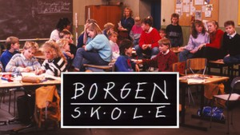

# NRK Programs Processed
| title              |   segments |   hours |
|:-------------------|-----------:|--------:|
|  Alle sammen sammen |       2292 |     1   |
| Ante               |       3951 |     0.9 |
| Barnas supershow   |       1202 |     1   |
| Borgen skole       |       2309 |     0.9 |

**A total of 3.8 hours in the dataset**

View detailed summary

## Detailed View
| title              | program_id   | subtitle                    | category     |   segments |   hours |
|:-------------------|:-------------|:----------------------------|:-------------|-----------:|--------:|
| Alle sammen sammen | MSUB22000113 | 1. episode                  | barn         |        753 |     0.3 |
| Alle sammen sammen | MSUB22000213 | 2. episode                  | barn         |        763 |     0.3 |
| Alle sammen sammen | MSUB22000313 | 3. episode                  | barn         |        776 |     0.4 |
| Ante               | FBUA06000075 | 1. episode                  | drama-serier |       1268 |     0.3 |
| Ante               | FBUA06000175 | 2. episode                  | drama-serier |       1308 |     0.3 |
| Ante               | FBUA06000275 | 3. episode                  | drama-serier |       1375 |     0.3 |
| Barnas supershow   | MSUS01004710 | 1. episode                  | barn         |        372 |     0.3 |
| Barnas supershow   | MSUS01004810 | 2. episode                  | barn         |        389 |     0.3 |
| Barnas supershow   | MSUS01004910 | 3. episode                  | barn         |        441 |     0.3 |
| Borgen skole       | FBUA03003087 | 1. Borgen skole - klasse 6B | barn         |        696 |     0.3 |
| Borgen skole       | FBUA03003187 | 2. Borgen skole - klasse 6B | barn         |        888 |     0.3 |
| Borgen skole       | FBUA03003287 | 3. Borgen skole - klasse 6B | barn         |        725 |     0.3 |

