# NRK Programs Processed
## SUMMARY - hours
| category              | tv   | radio                    |   **total** |
|:-------------------|-------------:|----------------------------:|---------------------------:|
| debug | 0.0 | 34.8                  |        **34.8** |
| **total** | **0.0** | **34.8**                  |        **34.8** |

## debug
|                                                                                           | title                                                                            |   programs |   segments |   average(s) |   hours |
|:------------------------------------------------------------------------------------------|:---------------------------------------------------------------------------------|-----------:|-----------:|-------------:|--------:|
| 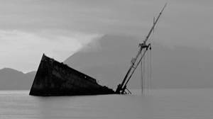     | Norske skipsforlis - Fiskebåten Brattegga                                        |          1 |         11 |          5.5 |     0   |
|      | Norske skipsforlis - Rigel                                                       |          1 |         10 |          4.9 |     0   |
|      | Norske skipsforlis - Ulf Jarl                                                    |          1 |         10 |          5.8 |     0   |
|      | Sergej er utenlandsk agent                                                       |          1 |          7 |          9.9 |     0   |
| 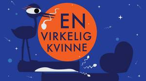     | En virkelig kvinne: Bivirkninger (2:8)                                           |          1 |          7 |          7.5 |     0   |
|      | Rød mann/Sort mann - Mysteriet (6:8)                                             |          1 |         12 |          3   |     0   |
| 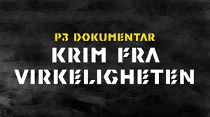 | 19 år og dopdealer                                                               |          1 |          8 |          8.3 |     0   |
| 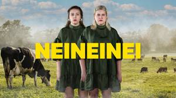     | Inderlig fylleprat, sjekking og brutal avvisning                                 |          1 |          4 |         19.1 |     0   |
|      | Familien Karamasov 51: Ivan, Djevelen og Gaffel-mysteriet                        |          1 |          5 |         12.1 |     0   |
|      | Familien Karamasov 57: Farskap, domfellelse og mystisk sobel                     |          1 |          6 |          9.8 |     0   |
| 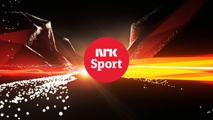     | 20 km intervall                                                                  |          1 |        207 |         40.9 |     2.4 |
|      | Hopp                                                                             |          1 |        227 |         12.3 |     0.8 |
|      | Hopp lagsprint                                                                   |          1 |        228 |         12.3 |     0.8 |
|      | Kombinert kvinner                                                                |          1 |         30 |         35.9 |     0.3 |
|      | Kombinert og jaktstart                                                           |          1 |        229 |         29.5 |     1.9 |
|      | Lagsprint stafett                                                                |          1 |         91 |         29.9 |     0.8 |
|      | Sprint                                                                           |          1 |        412 |         21   |     2.4 |
|      | Sprint finaler                                                                   |          1 |        117 |         28.3 |     0.9 |
|      | Sprint finaler og kombinert menn                                                 |          1 |         94 |         35.7 |     0.9 |
|      | Sprint og motbakkeløp                                                            |          1 |        340 |         29.3 |     2.8 |
| 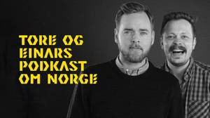     | Episode 2: Innvandring                                                           |          1 |         17 |        112.3 |     0.5 |
|      | "Psykologiens historie - sånn jeg ser det" 8:8                                   |          1 |          6 |         12.4 |     0   |
|      | 06.12.18 Adam har hatt bursdag!                                                  |          1 |          4 |         16.9 |     0   |
| 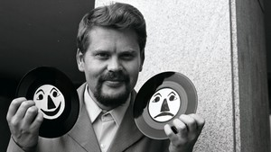     | 24. desember 2017                                                                |          1 |        261 |          4.1 |     0.3 |
| 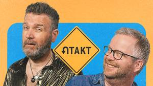     | Cola nummer 350 og pensjonister på fly                                           |          1 |          3 |         27   |     0   |
|      | Mentalt forstyrret nordmann, snålt fylke og en flink prins                       |          1 |          3 |         24.8 |     0   |
| 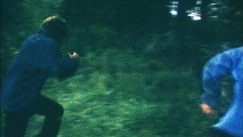     | 3. Skurker i pensjon                                                             |          1 |        307 |          3.3 |     0.3 |
| 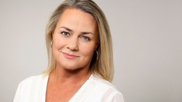     | Ring inn musikken - 23 04 11 22                                                  |          1 |        116 |          8.9 |     0.3 |
| 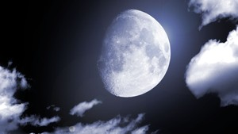     | 10. september                                                                    |          3 |        232 |          4.1 |     0.3 |
|      | 10. september                                                                    |          3 |        269 |         16.4 |     1.2 |
| 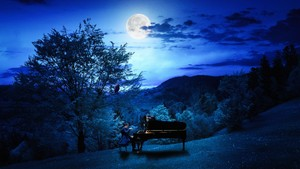     | 10. september                                                                    |          3 |         44 |          1   |     0   |
|      | fra Høllafæst                                                                    |          1 |        549 |          7.4 |     1.1 |
|      | Lydias verste ghostehistorie                                                     |          1 |          2 |         36.4 |     0   |
|      | Zara ble frastjålet daten på skoleball                                           |          1 |          3 |         23.9 |     0   |
| 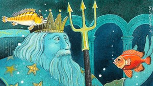     | 3. episode                                                                       |          3 |         56 |         16.5 |     0.3 |
|      | 3. episode                                                                       |          3 |         38 |         30   |     0.3 |
| 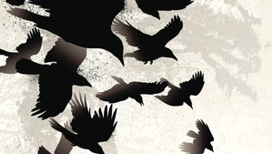     | 3. episode                                                                       |          3 |        195 |          4.5 |     0.2 |
|      | Barnas hær i Uganda                                                              |          1 |          5 |         12.9 |     0   |
|      | Da Nelson Mandela skulle settes fri                                              |          1 |          7 |          9.3 |     0   |
|      | Liberia i kaos og oppløsning.                                                    |          1 |          7 |          9   |     0   |
|      | 20. april 2018                                                                   |          1 |        143 |          9.2 |     0.4 |
| 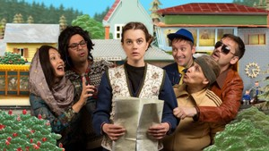     | 53. Visit Noreg - Radioteatret                                                   |          1 |         12 |          7   |     0   |
| 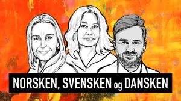     | Valginnspurt, segregering i Skandinavia og guru i trøbbel                        |          1 |          6 |         12.7 |     0   |
| 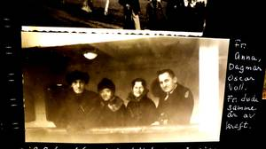     | De fortapte pikers øy                                                            |          1 |          8 |          4.3 |     0   |
|      | Episode 19: Preben Vildalen                                                      |          1 |          6 |          9.4 |     0   |
| 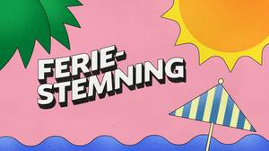     | Ary og Sunniva Lindgaard                                                         |          1 |          3 |         26.8 |     0   |
|      | Podagra, Pepperkakehus og Duer                                                   |          1 |          1 |         84.8 |     0   |
|      | 5. september 2021                                                                |          1 |         50 |         19.7 |     0.3 |
| 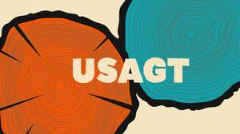     | Usagt: Martin                                                                    |          1 |         11 |          6.1 |     0   |
| 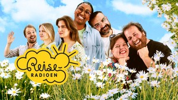     | 9. august                                                                        |          1 |        310 |         17.4 |     1.5 |
| 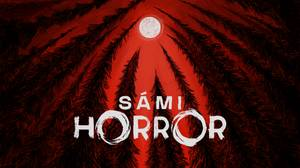     | Imaš oainnáhusat / Rare syner (episode 22)                                       |          1 |          9 |          5.9 |     0   |
|      | Mátkis / På reise (episode 15)                                                   |          1 |         10 |          3.7 |     0   |
| 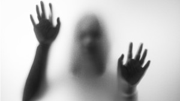     | 2. Sara                                                                          |          1 |         98 |         13.9 |     0.4 |
| 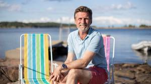     | To i campingstol: Finansrådgiver Bente Olafsen og finansminister Jan Tore Sanner |          1 |          3 |         17.9 |     0   |
| 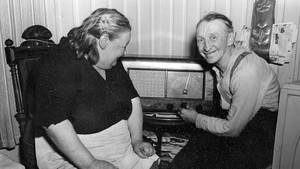     | 21. desember 2017                                                                |          1 |        189 |         14.3 |     0.8 |
|      | Don Juan bak masken                                                              |          1 |          4 |         19   |     0   |
|      | En ny sjanse?                                                                    |          1 |         17 |          4.7 |     0   |
|      | Kvinne funnet død på badeplass                                                   |          1 |         11 |          6.8 |     0   |
|      | Mysteriet om Morderen uten ansikt                                                |          1 |          5 |         20   |     0   |
|      | Torpedo i glemselens hav                                                         |          1 |          8 |          8.8 |     0   |
|      | Kjappis i kirka                                                                  |          1 |          5 |         14.3 |     0   |
|      | # 21 Er høyreekstremismen i vekst?                                               |          1 |          3 |         22.4 |     0   |
|      | #10 Hva bør vi spise? Når bør vi spise?                                          |          1 |          2 |         33.5 |     0   |
|      | #8 Hvorfor ytre høyre vinner debatten                                            |          1 |          4 |         15.4 |     0   |
|      | Bergen i raudt, kvitt og blått                                                   |          1 |          5 |         12.3 |     0   |
|      | Bymann og stril                                                                  |          1 |          6 |         11.9 |     0   |
| 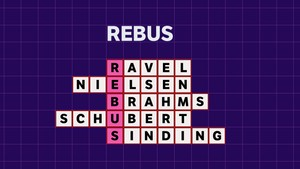     | Rebus                                                                            |          1 |         51 |         12.8 |     0.2 |
|      | Alicia blir Alex                                                                 |          1 |          5 |         14.1 |     0   |
|      | Intet mindre enn en orgasme                                                      |          1 |          6 |         16.3 |     0   |
| 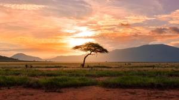     | Afrikas historie del 5 Nomadeliv og det sørlige Afrika                           |          1 |          8 |          6.2 |     0   |
|      | 1. Følgene av en togforsinkelse                                                  |          1 |        114 |         11.3 |     0.4 |
|      | 10. To halve tredukker                                                           |          1 |        124 |          9.7 |     0.3 |
|      | 11. Den hellige skarabeen                                                        |          1 |        209 |          5.9 |     0.3 |
|      | 12. Tvillinger søker hverandre                                                   |          1 |        157 |          9.2 |     0.4 |
|      | 2. Selandergården                                                                |          1 |        211 |          5.7 |     0.3 |
|      | 3. Loftsrommet                                                                   |          1 |        233 |          4.2 |     0.3 |
|      | 4. Hviler det en forbannelse over Selandergården?                                |          1 |        232 |          4.5 |     0.3 |
|      | 5. Vanskelige gåter                                                              |          1 |        149 |          7.1 |     0.3 |
|      | 6. Nyheten slipper ut                                                            |          1 |        111 |         10.8 |     0.3 |
|      | 7. Tilståelsen                                                                   |          1 |        145 |          6.9 |     0.3 |
|      | 8. En tyngre gjenstand                                                           |          1 |        129 |         10.2 |     0.4 |
|      | 9. En stemme på kassetten                                                        |          1 |        159 |          6   |     0.3 |
|      | Kranglar med eks og bestevenn | Agnete Husebye                                   |          1 |          2 |         37.4 |     0   |
|      | Harald Gråfell - Kongen som tjente seg selv, og ikke landet (4:30)               |          1 |          8 |          6.8 |     0   |
|      | Håkon den gode - Kongen som var helt konge, for alle utenom seg selv (3:30)      |          1 |          9 |          5.1 |     0   |
|  | De lettlurte                                                                     |          1 |         10 |          9.1 |     0   |
|      | Pressekonferansen, brystpumpa og superonsdag!                                    |          1 |          2 |         41.8 |     0   |
|      | Pardon me                                                                        |          1 |          4 |         18.5 |     0   |
|      | Kristine og Harald: Optimisme (2:9)                                              |          1 |          5 |         15.5 |     0   |
|      | Tirill: Evig singel (1:12)                                                       |          1 |          4 |         16.8 |     0   |
|      | Tirill: Jeg skjønner! (9:12)                                                     |          1 |          7 |          9.9 |     0   |
|      | 1. mai 2017                                                                      |          1 |        222 |         10.7 |     0.7 |
| 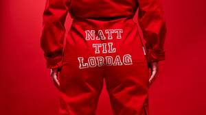     | Natt til lørdag (8:18)                                                           |          1 |         11 |          5.3 |     0   |
| 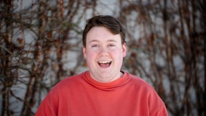     | 5. november 2020                                                                 |          1 |        495 |          6.2 |     0.9 |
|      | Trygve Lie del 3                                                                 |          1 |          7 |         14.3 |     0   |
| 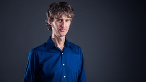     | 31. desember 2017                                                                |          1 |        138 |          8.9 |     0.3 |
| 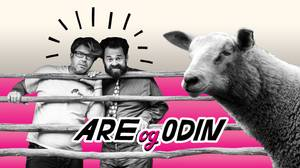     | Amadeus- ros, Putin- sang, delfin- rusing                                        |          1 |          5 |         15.7 |     0   |
|      | Ost, ottomanere og optimisme                                                     |          1 |          2 |         41.5 |     0   |
|      | Par- terapi, sprengt hval, dyrenes hevn                                          |          1 |          3 |         27.1 |     0   |
| 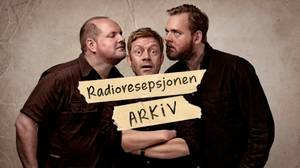     | Den internasjonale øltesten                                                      |          1 |          2 |         39.2 |     0   |
|      | En flott, fin vinterdag                                                          |          1 |          1 |         84.6 |     0   |
| 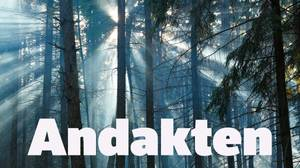     | Når Gud blir borte - ved Alex Ramstad Døsvik                                     |          1 |         15 |          4.1 |     0   |
| 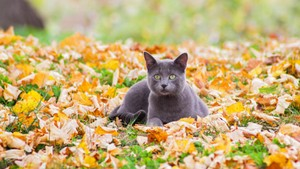     | 6. Leteaksjon                                                                    |          1 |        121 |          9.2 |     0.3 |
| 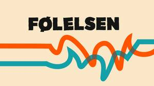     | Følelsen: Skadefryd                                                              |          1 |          3 |         26.2 |     0   |
|      | Ny podkast om følelsene våre                                                     |          1 |          1 |         40.8 |     0   |
| 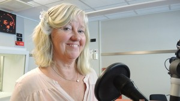     | Bakoversnakk                                                                     |          1 |        152 |         18.2 |     0.8 |
|      | 11. juni 2021                                                                    |          1 |        305 |          9.3 |     0.8 |
|      | 14. mai 2021                                                                     |          2 |        210 |         14.5 |     0.8 |
|      | 18. juni 2021                                                                    |          1 |         55 |         14.8 |     0.2 |
|      | 21. mai 2021                                                                     |          1 |         64 |         16.6 |     0.3 |
|      | 25. juni 2021                                                                    |          2 |        253 |         12.9 |     0.9 |
|      | 28. mai 2021                                                                     |          1 |         62 |         16.6 |     0.3 |
|      | 4. juni 2021                                                                     |          1 |        104 |          8.7 |     0.3 |
| 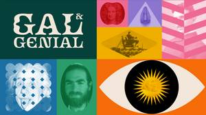     | Henry Cavendish & den ekstreme blygheten                                         |          1 |          3 |         25.4 |     0   |
|      | Hvem er Peter Madsen? (3:4)                                                      |          1 |          4 |         13   |     0   |
| 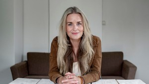     | Öde Nerdrum                                                                      |          1 |        173 |         18.1 |     0.9 |
|      | Game of Thrones: S8E3 – The Long Night                                           |          1 |          1 |         85.2 |     0   |
|      | House of the Dragon: Forventninger                                               |          1 |          4 |         19.3 |     0   |
|      | Ringenes Herre: Kommentarspor: Ringens brorskap                                  |          1 |          5 |         15   |     0   |
|      | Ringenes herre: Maktens ringer: S1E4 - The Great Wave                            |          1 |          3 |         23.5 |     0   |
|      | The Mandalorian S2E3 - The Heiress                                               |          1 |          7 |         10.1 |     0   |
| 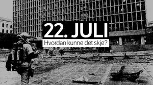 | År 2001 (1:6)                                                                    |          1 |          7 |          5.1 |     0   |
| 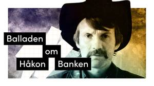     | Balladen om Håkon Banken (1:4): Hvordan tror du verden ser på meg?               |          1 |          8 |          8.6 |     0   |

