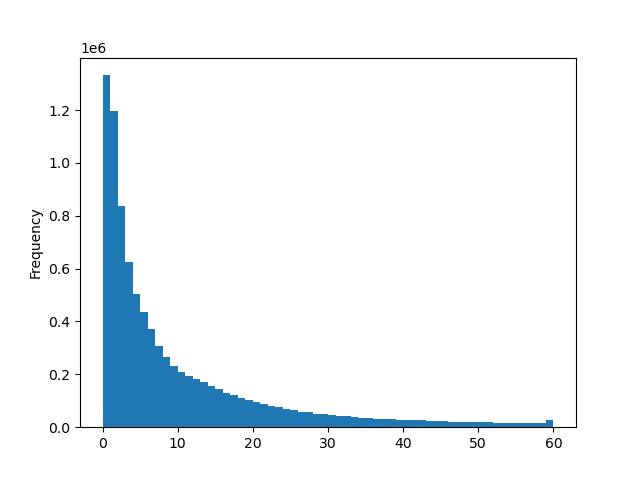

# NRK Programs Processed
## SUMMARY - hours
| category              | tv   | radio                    |   **total** |
|:-------------------|-------------:|----------------------------:|---------------------------:|
| standard | 0.0 | 1.1                  |        **1.1** |
| umbrella | 0.0 | 0.6                  |        **0.6** |
| Musikk | 0.0 | 6.9                  |        **6.9** |
| Underholdning | 0.0 | 3.8                  |        **3.8** |
| sequential | 0.0 | 5.8                  |        **5.8** |
| Sport | 0.0 | 13.9                  |        **13.9** |
| Kultur | 0.0 | 1.0                  |        **1.0** |
| Dokumentar/fakta | 0.0 | 1.6                  |        **1.6** |
| **total** | **0.0** | **34.8**                  |        **34.8** |

## Sequence Length

 9,648 segments. 429(4%) longer than 60 seconds (not displayed)

## standard
|                                                                                         | serie_title                      |   programs |   segments |   average(s) |   hours |
|:----------------------------------------------------------------------------------------|:---------------------------------|-----------:|-----------:|-------------:|--------:|
|  | Krig og fred                     |          1 |          7 |          9.9 |     0   |
|  | Nei nei nei                      |          1 |          4 |         19.1 |     0   |
|  | Salongens lesesirkel             |          2 |         11 |         10.9 |     0   |
|  | Tore og Einars podkast om Norge  |          1 |         17 |        112.3 |     0.5 |
|  | KRAFT                            |          1 |          6 |         12.4 |     0   |
|  | Andregenerasjonen                |          1 |          4 |         16.9 |     0   |
|  | Utakt                            |          1 |          3 |         27   |     0   |
|  | Satiriks redaksjonsmøte          |          1 |          3 |         24.8 |     0   |
|  | Tomms afrikanske fortellinger    |          3 |         19 |         10.1 |     0.1 |
|  | Norsken, svensken og dansken     |          1 |          6 |         12.7 |     0   |
|  | Timeout                          |          1 |          6 |          9.4 |     0   |
|  | Berrum & Beyer snakker om greier |          1 |          1 |         84.8 |     0   |
|  | Sámi Horror                      |          2 |         19 |          4.7 |     0   |
|  | Juntafil                         |          1 |          5 |         14.3 |     0   |
|  | Tore Sagens podkast              |          3 |          9 |         21.8 |     0.1 |
|  | Unormal                          |          1 |          2 |         37.4 |     0   |
|  | Friminutt med Herman og Mikkel   |          1 |          2 |         41.8 |     0   |
|  | Trump mot verden                 |          1 |          4 |         18.5 |     0   |
|  | Are og Odin                      |          3 |         10 |         24.3 |     0.1 |
|  | Radioresepsjonens arkivpodkast   |          2 |          3 |         54.4 |     0   |
|  | Andakten                         |          1 |         15 |          4.1 |     0   |
|  | Gal & genial                     |          1 |          3 |         25.4 |     0   |

## umbrella
|                                                                                             | serie_title              |   programs |   segments |   average(s) |   hours |
|:--------------------------------------------------------------------------------------------|:-------------------------|-----------:|-----------:|-------------:|--------:|
|      | Norske skipsforlis       |          3 |         31 |          5.4 |     0   |
|      | Radioteatret             |          2 |         19 |          4.6 |     0   |
|  | Krim fra virkeligheten   |          1 |          8 |          8.3 |     0   |
|      | Flukt og krig            |          1 |          8 |          4.3 |     0   |
|      | Usagt                    |          1 |         11 |          6.1 |     0   |
|      | To i campingstol         |          1 |          3 |         17.9 |     0   |
|      | Kriminalitet             |          5 |         45 |          8.9 |     0.1 |
|      | Kropp og seksualitet     |          2 |         11 |         15.3 |     0   |
|      | Afrikas historie         |          1 |          8 |          6.2 |     0   |
|      | Kongerekka               |          2 |         17 |          5.9 |     0   |
|  | Følg pengene             |          1 |         10 |          9.1 |     0   |
|      | Kristine og Harald       |          1 |          5 |         15.5 |     0   |
|      | Tirill                   |          2 |         11 |         12.4 |     0   |
|      | Trygve Lie               |          1 |          7 |         14.3 |     0   |
|      | Følelsen                 |          2 |          4 |         29.8 |     0   |
|      | Filmpolitiet             |          5 |         20 |         18.9 |     0.1 |
|      | Balladen om Håkon Banken |          1 |          8 |          8.6 |     0   |

## Musikk
|                                                                                         | serie_title                 |   programs | segments   |   average(s) |   hours |
|:----------------------------------------------------------------------------------------|:----------------------------|-----------:|:-----------|-------------:|--------:|
|  | Ring inn musikken           |          1 | 116        |          8.9 |     0.3 |
|  | Nattradioen                 |          1 | 232        |          4.1 |     0.3 |
|  | Urørt                       |          1 | 549        |          7.4 |     1.1 |
|  | Filmmusikk med Wolfgang Wee |          1 | 50         |         19.7 |     0.3 |
|  | Rebus - radio               |          1 | 51         |         12.8 |     0.2 |
|  | Nattsvermeren               |          1 | 44         |          1   |     0   |
|  | Kristian                    |          1 | 495        |          6.2 |     0.9 |
|  | Atlantis                    |          1 | 138        |          8.9 |     0.3 |
|  | Fredag med Ingrid og Petter |          9 | 1,053      |         12.3 |     3.6 |

## Underholdning
|                                                                                         | serie_title            |   programs |   segments |   average(s) |   hours |
|:----------------------------------------------------------------------------------------|:-----------------------|-----------:|-----------:|-------------:|--------:|
|  | Bare Erik              |          1 |        261 |          4.1 |     0.3 |
|  | Reiseradioen           |          1 |        310 |         17.4 |     1.5 |
|  | Radiojula gjennom tiår |          1 |        189 |         14.3 |     0.8 |
|  | Nitimen                |          1 |        269 |         16.4 |     1.2 |

## sequential
|                                                                                             | serie_title                        |   programs | segments   |   average(s) |   hours |
|:--------------------------------------------------------------------------------------------|:-----------------------------------|-----------:|:-----------|-------------:|--------:|
|      | Rømlingene (1984)                  |          1 | 307        |          3.3 |     0.3 |
|      | Baksnakk                           |          2 | 5          |         28.9 |     0   |
|      | Kong Neptun og perlejakten         |          1 | 56         |         16.5 |     0.3 |
|      | Radioteatret - Visit Noreg         |          1 | 12         |          7   |     0   |
|      | Feriestemning                      |          1 | 3          |         26.8 |     0   |
|      | Ansiktet i skyggen                 |          1 | 98         |         13.9 |     0.4 |
|      | Nokke for seg sjøl                 |          2 | 11         |         12.1 |     0   |
|      | Tordivelen flyr i skumringen       |         12 | 1,973      |          7.1 |     3.9 |
|      | Roboten er løs                     |          1 | 38         |         30   |     0.3 |
|      | Natt til lørdag                    |          1 | 11         |          5.3 |     0   |
|      | Nattfuglene                        |          1 | 195        |          4.5 |     0.2 |
|      | Sascha                             |          1 | 121        |          9.2 |     0.3 |
|      | Ubåtsaken                          |          1 | 4          |         13   |     0   |
|  | 22. JULI - Hvordan kunne det skje? |          1 | 7          |          5.1 |     0   |

## Sport
|                                                                                         | serie_title             |   programs | segments   |   average(s) |   hours |
|:----------------------------------------------------------------------------------------|:------------------------|-----------:|:-----------|-------------:|--------:|
|  | Kombinert - radio       |          3 | 546        |         15.2 |     2.3 |
|  | Toppidrettsveka - radio |          7 | 1,429      |         29.1 |    11.6 |

## Kultur
|                                                                                         | serie_title             |   programs |   segments |   average(s) |   hours |
|:----------------------------------------------------------------------------------------|:------------------------|-----------:|-----------:|-------------:|--------:|
|  | Kulturreportasjen Kunst |          1 |        143 |          9.2 |     0.4 |
|  | Første mai med Bibbi    |          1 |        222 |         10.7 |     0.7 |

## Dokumentar/fakta
|                                                                                         | serie_title                     |   programs |   segments |   average(s) |   hours |
|:----------------------------------------------------------------------------------------|:--------------------------------|-----------:|-----------:|-------------:|--------:|
|  | Bakoversnakk/Dette vil jeg dele |          1 |        152 |         18.2 |     0.8 |
|  | Sammen med Sandvik              |          1 |        173 |         18.1 |     0.9 |

